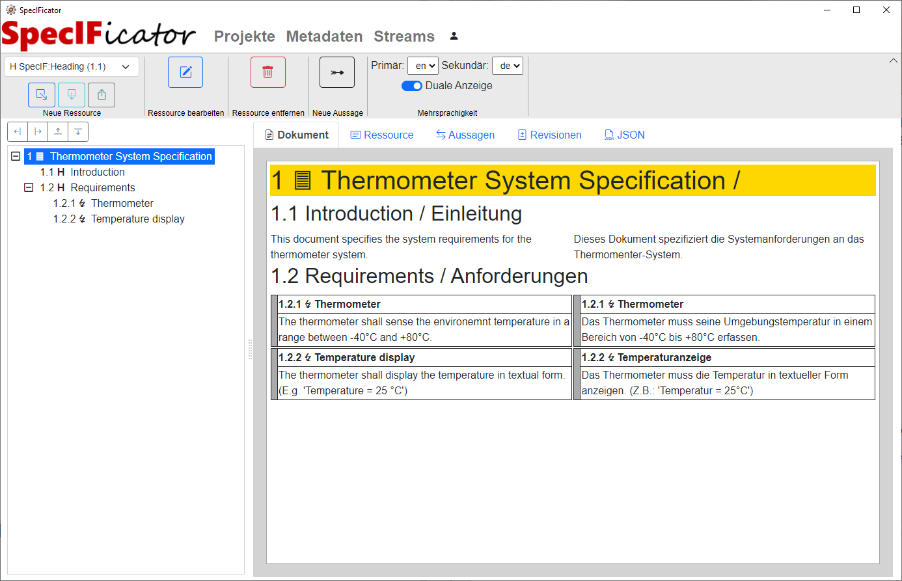

{width=50%}
## A reference implementation and open source framework for the SpecIFication Integration Facility (SpecIF) in .NET

More information can be found at https://www.specificator.com

{width=75%}

## Resources

* https://github.com/oalt
* https://github.com/GfSE/SpecIF
* https://specif.de/de/
* https://mdd4all.de/